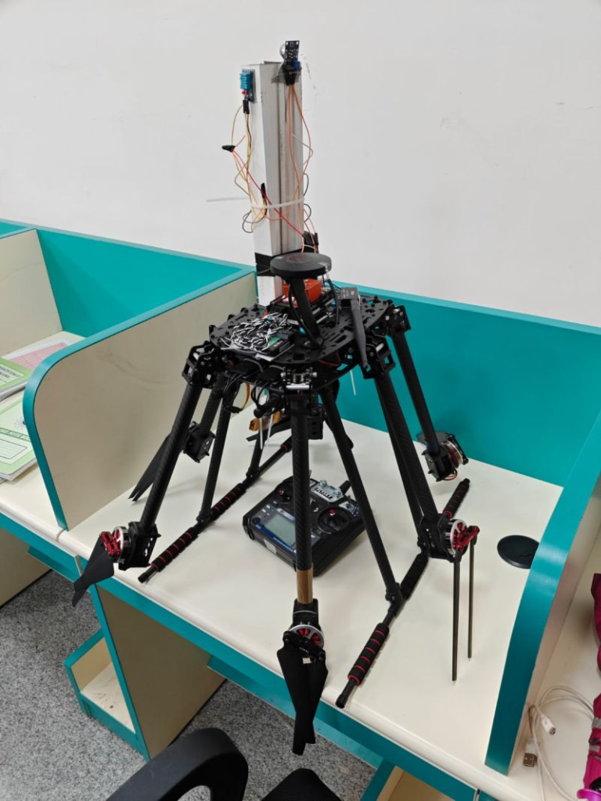
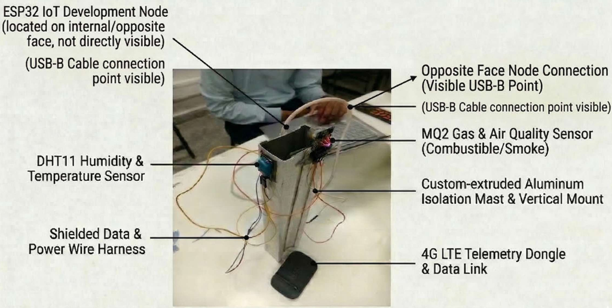
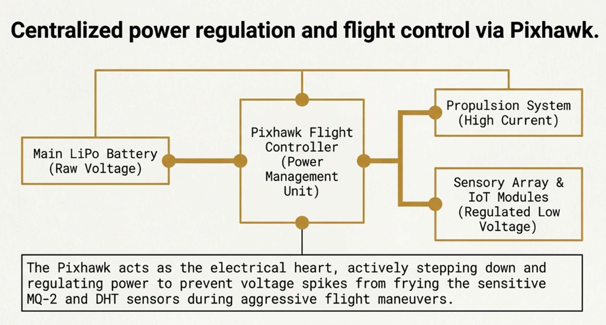

As project lead, I directed the development of a high-stability hexacopter for environmental intelligence in hazardous zones. Created for our Design Realisation Practice, the drone integrates a carbon-fiber frame, a Pixhawk 4 autopilot, and an ESP32 sensor node to monitor gas levels and climate conditions. We implemented a custom data-smoothing algorithm to transmit steady, real-time telemetry over 4G to Blynk Cloud. During our field trials, we successfully demonstrated real-time hazard detection, earning high commendation from our professor.

## Technical Architecture & Build

- **Airframe:** A high-strength Carbon Fiber and Nylon hexacopter chassis, selected for structural integrity, wind resistance, and payload capacity.
- **Flight Control:** Driven by a Pixhawk 4 (FMUv5) autopilot system featuring dual IMUs and a UBLOX NEO-M8N GPS module for precise telemetry and waypoint-guided path execution.
- **Environmental Sensing:** Fused gas (MQ-2) and climate (DHT11) sensors onto an ESP32 edge node to monitor toxic gases, temperature, and humidity.
- **Signal Filtering:** Designed a custom data-smoothing algorithm to filter out environmental sensor signal noise, maintaining a steady baseline for gas detection.
- **Data Transmission:** Broadcasts live readings to Blynk IoT Cloud over a 4G cellular link, enabling immediate remote viewing of environmental safety levels.

### Physical Sensor Node Integration

To protect our sensor readings from electrical interference and the hexacopter's rotor wash, we built a dedicated vertical sensor payload.

This payload assembly is built around a custom-extruded aluminum isolation mast:
- **Sensor Placement:** An MQ-2 gas sensor is mounted on one side to measure smoke and combustible gases. A DHT11 sensor sits on the opposite side to record temperature and humidity while staying isolated from component heat.
- **Edge Computing:** An ESP32 microcontroller is secured to the inner face, running the data-smoothing algorithms locally to filter noise before transmission.
- **Shielding & Connectivity:** All wiring is routed through a shielded harness to prevent electromagnetic cross-talk, feeding directly into a 4G LTE dongle that uploads telemetry.

### Centralized Power & Flight Regulation

To maintain flight stability and protect low-voltage sensors from power fluctuations, we designed a regulated power architecture.

The system regulates power through a centralized distribution scheme:
- **Propulsion Power:** The main LiPo battery feeds raw voltage directly to the Pixhawk 4 Power Management Unit, which safely routes high-current lines to the ESCs and motors.
- **Sensor Power Isolation:** The Pixhawk's power management unit steps down and regulates voltage to low-noise power lines. This isolates the sensitive ESP32 processor and the MQ-2 / DHT11 sensors from voltage spikes, which typically occur during aggressive throttle changes or rapid acceleration maneuvers.

## Live Field Testing & Results

During field trials, we successfully tested the hexacopter across structured, pilot-controlled flight profiles. The system successfully detected changes in gas concentrations, triggered immediate notifications, and logged real-time environmental data on our remote dashboard. Our professor was very impressed with the project's execution and technical depth.

## Team Collaboration & Leadership

Working on this project with my classmates was incredibly rewarding. As the project lead, I orchestrated the team’s workflow, calibrated the sensors, guided telemetry debugging, and managed the overall integration to ensure the flight system performed reliably.
